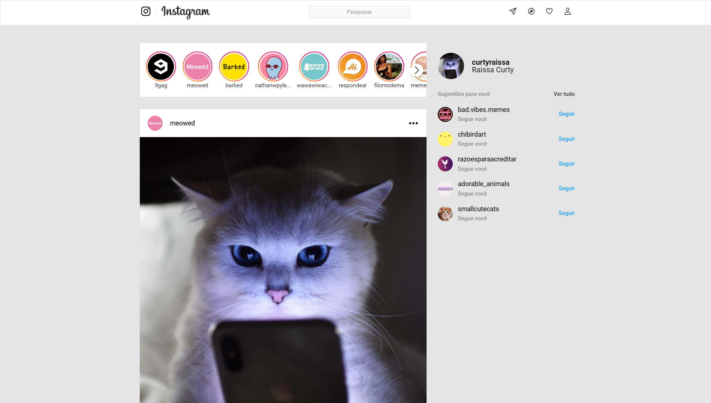

<h1 align="center">Projeto Instagram desktop, tablet e mobile </h1>

Esse desafio, foi desenvolver a aplicação do instagram a partir de um layout, colocando em prática tudo o que aprendi.

- [x]  Aplicar layout para *desktop*, seguindo layout fornecido no Figma;
- [x]  Aplicar layout para *mobile*, seguindo layout fornecido no Figma;
- [x]  O layout sem *sidebar* deve ser ativado quando a largura da tela for menor que 935px;
- [x]  O layout para *mobil*e deve ser ativado quando a largura da tela for inferior a 614px;
- [x]  Não é obrigatório que a *sidebar* fique fixa conforme o usuário desce na página como ocorre no Instagram (mas é um bônus).

## 🛠 &nbsp;Skills

  
  
          
  
                                     

## 🚀 &nbsp;Links

- [Figma](https://www.figma.com/file/rrweaBwWqOc9pAzk288mKB/Projeto-Instagram?node-id=23%3A133&t=GLlY8Hd2jYUlyGOR-0). 
- [Deploy](https://instagram-html-css.vercel.app/). 
___

## 💬 &nbsp;Contact

Feito por [Raissa Curty](https://github.com/curtyraissa)!

&nbsp;
